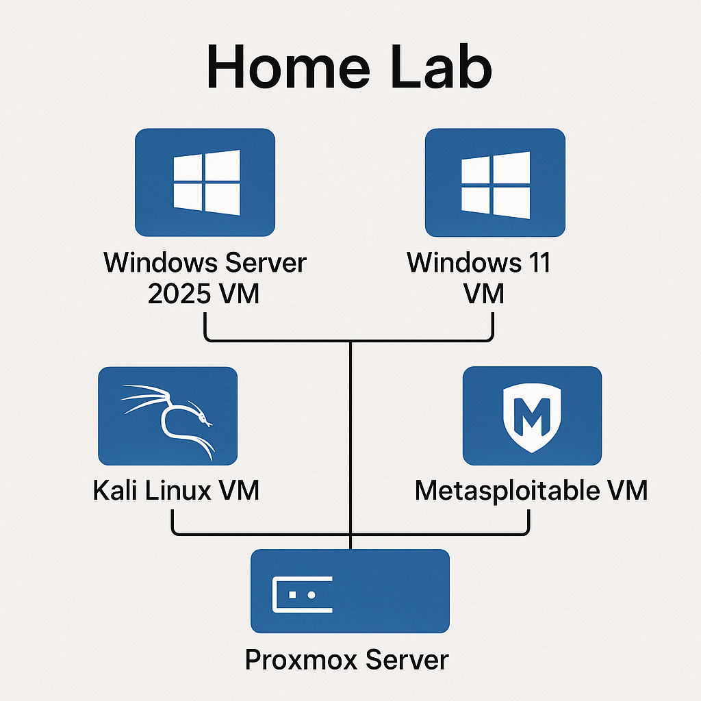

# Project-Parabellum
Project-Parabellum is my personal cybersecurity home lab — a place where I actively sharpen my skills, test new ideas, and grow as a security engineer.
The name comes from the Latin phrase “si vis pacem, para bellum” — “If you want peace, prepare for war.”
I see this saying as a philosophy for both life and cybersecurity: preparation, discipline, and continuous improvement.

This lab is my training ground. It’s where I break things, fix things, analyze attacks, build defenses, and practice the craft of modern security engineering. It also serves as a public record of what I’m learning, what I’m building, and how others can recreate a similar environment at home to strengthen their own skills.

My goal with Project-Parabellum is simple:
to become a true professional in this field while helping others learn, experiment, and “prepare for war” in the world of cyber defense.

---

## Lab Infrastructure

My homelab is built on **Proxmox** running multiple virtual machines that simulate a real enterprise environment. Think of it as my personal cyber battlefield where I can safely break things and learn how they work!

### The Setup
| VM | Purpose | Status | Key Features |
|---|---|---|---|
| **Kali Linux** | Attack platform | 🟢 Running | Penetration testing, security auditing |
| **Metasploitable 2** | Vulnerable target | 🟢 Running | Practice environment, DVWA hosted |
| **Windows 11** | Domain workstation | 🟢 Running | Joined to LAB.local domain |
| **Windows Server 2025** | Domain Controller | 🟢 Running | AD DS, AD CS, user management |

---

## What I've Built (So Far!)

### Active Directory Environment
Built a fully functional Windows domain environment from scratch:
- Configured Windows Server 2025 as Domain Controller
- Installed Active Directory Domain Services (AD DS)
- Installed Active Directory Certificate Services (AD CS)
- Created domain users
- Joined Windows 11 workstation to domain

**Why this matters:** Understanding Active Directory is crucial for both defense (securing it) and offense (attacking it). Most enterprise environments use AD, so this gives me real-world experience.

## Projects

### Upcoming Projects:
- **[SOC Lab Report](Security/SOC_lab.md)** - Setting up monitoring and detection
- **[AI Fundamentals Lab](AI/AI_fundamentals_lab.md)** - Lab project revolving around understanding AI fundamentals

---

